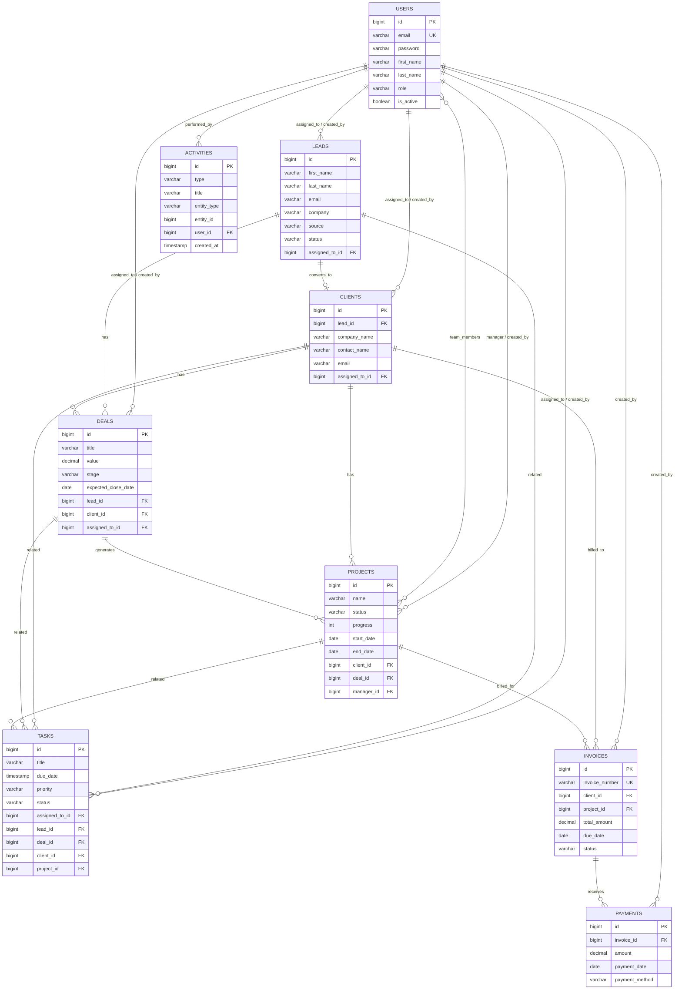

# ScratchIO CRM - Entity Relationship Diagram

## Business Flow

```
Lead → Deal → Client → Project → Invoice → Payment
```

## ERD Diagram



## Table Relationships Summary

| Parent | Child | Relationship | Description |
|--------|-------|--------------|-------------|
| users | leads | 1:N | User assigned/created leads |
| users | deals | 1:N | User assigned/created deals |
| users | clients | 1:N | User assigned/created clients |
| users | tasks | 1:N | User assigned/created tasks |
| users | projects | 1:N | User manages/creates projects |
| users | projects | M:N | Team members via project_members |
| leads | clients | 1:1 | Lead converts to client |
| leads | deals | 1:N | Lead associated with deals |
| clients | deals | 1:N | Client has deals |
| clients | projects | 1:N | Client has projects |
| clients | invoices | 1:N | Client receives invoices |
| deals | projects | 1:N | Won deal spawns project |
| projects | invoices | 1:N | Project generates invoices |
| invoices | payments | 1:N | Invoice receives payments |

## Enum Values

### Lead Status
`NEW` → `CONTACTED` → `MEETING_SCHEDULED` → `PROPOSAL_SENT` → `WON` / `LOST`

### Deal Stage
`QUALIFICATION` → `PROPOSAL` → `NEGOTIATION` → `WON` / `LOST`

### Project Status
`PLANNING` → `IN_PROGRESS` → `COMPLETED` / `ON_HOLD`

### Invoice Status
`DRAFT` → `SENT` → `PAID` / `OVERDUE`

### User Roles
`ADMIN` | `MANAGER` | `SALES_EXECUTIVE`
